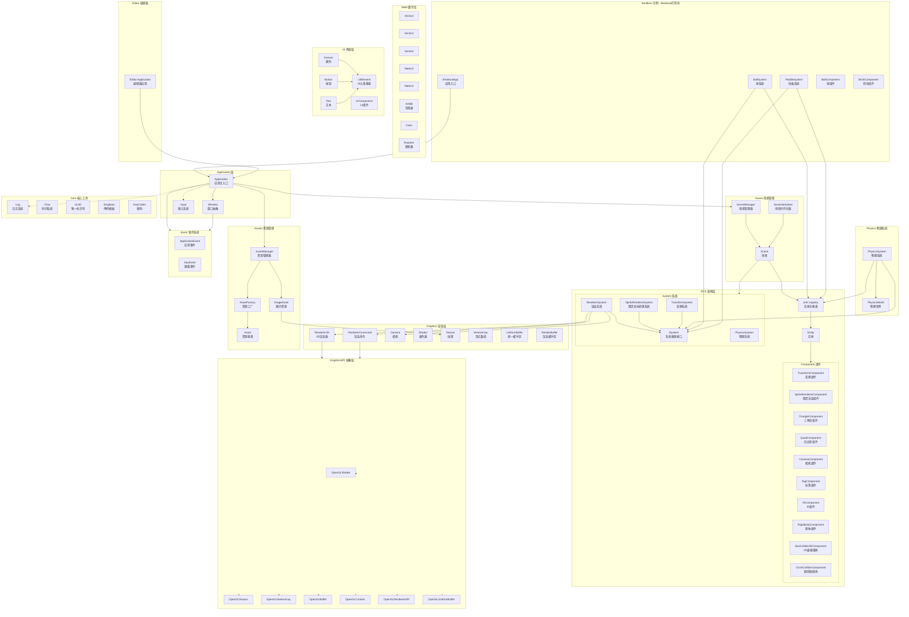
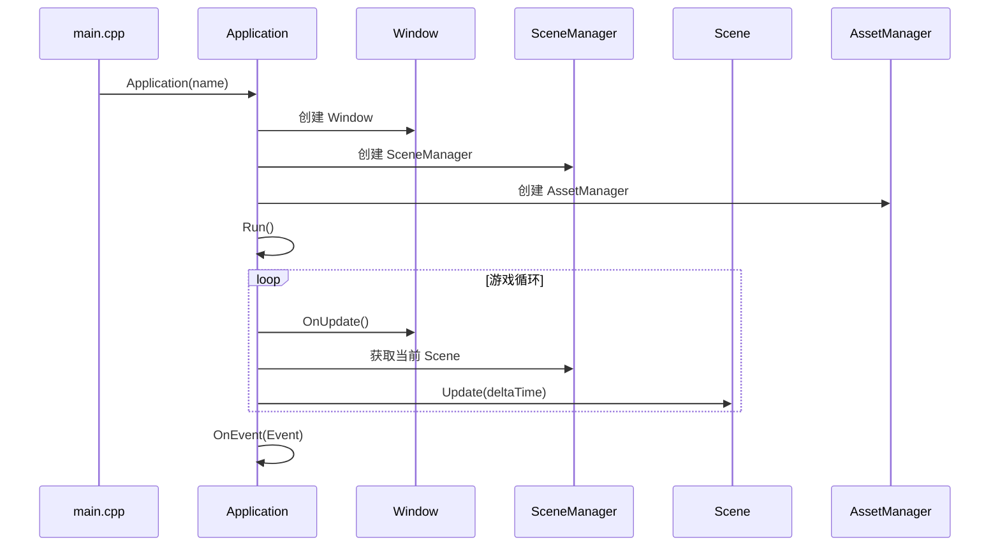
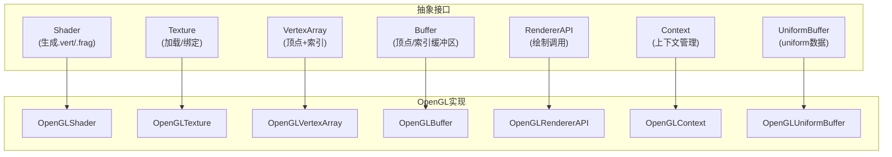
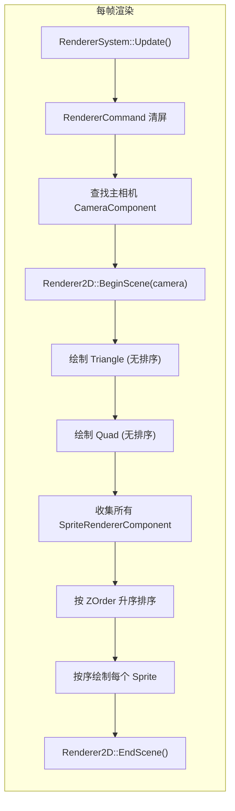

# Bamboo 游戏引擎项目架构文档

## 项目概述

Bamboo 是一个基于 **OpenGL** 的 2D 游戏引擎，采用 **ECS (Entity-Component-System)** 架构设计，使用 `entt` 库作为 ECS 核心。项目包含引擎核心库 (`Bamboo`)、示例游戏 (`Sandbox`) 和编辑器 (`Editor`)。

---

## 整体架构图



---

## 调用关系详细说明

### 1. 应用启动流程



### 2. 场景更新流程 (每帧调用)

```mermaid
sequenceDiagram
    participant Scene as Scene
    participant TS as TransformSystem
    participant SRS as SpriteRendererSystem
    participant RS as RendererSystem
    participant PS as PhysicsSystem
    participant LogicSys as 逻辑系统(Ball/Paddle)
    participant Reg as entt::registry

    Scene->>Reg: 获取实体
    Scene->>TS: Update(registry, dt)
    TS->>Reg: 更新 TransformComponent
    Scene->>SRS: Update(registry, dt)
    SRS->>Reg: 查找 CameraComponent + TransformComponent
    SRS->>Reg: 查找 SpriteRendererComponent + TransformComponent
    SRS->>SRS: 计算世界坐标 & 设置 LocalToWorldMatrix
    Scene->>PS: Update(registry, dt)
    PS->>Reg: 查找 RigidbodyComponent
    PS->>PS: 应用物理模拟
    Scene->>LogicSys: Update(registry, dt)
    LogicSys->>Reg: 处理游戏逻辑
    Scene->>RS: Update(registry, dt)
    RS->>RS: 清屏
    RS->>Reg: 查找 CameraComponent
    RS->>R2D: BeginScene(camera)
    RS->>Reg: 查找 TriangleComponent + QuadComponent
    RS->>R2D: DrawTriangle / DrawQuad
    RS->>Reg: 查找 SpriteRendererComponent
    RS->>RS: 按 ZOrder 排序
    RS->>R2D: DrawSprite(matrix, color, texture)
    RS->>R2D: EndScene()
```



### 3. 渲染系统详细流程

```mermaid
graph LR
    RS["RendererSystem::Update()"] --> Clear["RendererCommand::SetClearColor()<br/>RendererCommand::Clear()"]
    Clear --> FindCam["查找 CameraComponent<br/>获取 mainCamera"]
    FindCam --> Begin["Renderer2D::BeginScene(camera/null)"]
    Begin --> DrawTri["绘制 TriangleComponent<br/>Renderer2D::DrawTriangle"]
    DrawTri --> DrawQuad["绘制 QuadComponent<br/>Renderer2D::DrawQuad"]
    DrawQuad --> DrawSprite["绘制 SpriteRendererComponent<br/>按 ZOrder 排序后绘制"]
    DrawSprite --> End["Renderer2D::EndScene()"]
```



### 4. 图形API抽象层架构



---

## 目录结构

```
Bamboo/
├── Source/
│   ├── CMakeLists.txt                    # 顶层CMake
│   ├── Bamboo/                           # 引擎核心库
│   │   ├── CMakeLists.txt
│   │   ├── Bamboo.h                      # 引擎总头文件
│   │   ├── Core/                         # 核心工具
│   │   │   ├── Singleton.h               # 单例模板
│   │   │   ├── Log.h                     # 日志系统
│   │   │   ├── Time.cpp                  # 时间系统
│   │   │   ├── UUID.h / .cpp             # 唯一标识符
│   │   │   ├── Input.h                   # 输入系统
│   │   │   ├── KeyCodes.h                # 键码定义
│   │   │   ├── Ref.h / Base.h            # 智能指针/基类
│   │   │   └── Assert.h                  # 断言
│   │   ├── Game/                         # 游戏框架
│   │   │   ├── Application.h / .cpp       # 应用入口
│   │   │   └── Window.h / .cpp           # 窗口抽象
│   │   ├── ECS/                          # ECS架构
│   │   │   ├── Entity.h / .cpp           # 实体
│   │   │   ├── Component/                # 组件
│   │   │   │   ├── Component.h           # 组件集合头
│   │   │   │   ├── TransformComponent.h   # 变换
│   │   │   │   ├── SpriteRendererComponent.h # 精灵渲染
│   │   │   │   ├── TriangleComponent.h    # 三角形
│   │   │   │   ├── QuadComponent.h        # 四边形
│   │   │   │   ├── CameraComponent.h      # 相机
│   │   │   │   ├── TagComponent.h         # 标签
│   │   │   │   ├── IDComponent.h          # ID
│   │   │   │   ├── RigidbodyComponent.h   # 刚体
│   │   │   │   ├── BoxCollider2DComponent.h # 盒碰撞体
│   │   │   │   └── CircleColliderComponent.h # 圆形碰撞体
│   │   │   └── System/                   # 系统
│   │   │       ├── ISystem.h             # 系统基类
│   │   │       ├── RendererSystem.h / .cpp # 渲染系统
│   │   │       ├── SpriteRendererSystem.h / .cpp # 精灵坐标转换
│   │   │       └── TransformSystem.h / .cpp # 变换系统
│   │   ├── Graphics/                     # 渲染抽象层
│   │   │   ├── Renderer2D.h / .cpp        # 2D渲染器
│   │   │   ├── Renderer.h                # 渲染器接口
│   │   │   ├── RendererCommand.h / .cpp   # 渲染命令
│   │   │   ├── Camera.h                  # 相机
│   │   │   ├── Shader.h / .cpp           # 着色器
│   │   │   ├── Texture.h / .cpp          # 纹理
│   │   │   ├── VertexArray.cpp           # 顶点数组
│   │   │   ├── UniformBuffer.h / .cpp    # 统一缓冲区
│   │   │   ├── RenderBuffer.cpp          # 渲染缓冲区
│   │   │   └── GraphicsContext.h         # 图形上下文
│   │   ├── GraphicsAPI/                  # 图形API实现
│   │   │   └── OpenGL/                   # OpenGL实现
│   │   │       ├── OpenGLShader.h / .cpp
│   │   │       ├── OpenGLTexture.h / .cpp
│   │   │       ├── OpenGLVertexArray.h / .cpp
│   │   │       ├── OpenGLBuffer.h / .cpp
│   │   │       ├── OpenGLContext.h / .cpp
│   │   │       ├── OpenGLRendererAPI.h
│   │   │       └── OpenGLUniformBuffer.h / .cpp
│   │   ├── Scene/                        # 场景管理
│   │   │   ├── Scene.h / .cpp            # 场景(核心: 管理实体与系统)
│   │   │   ├── SceneManager.h            # 场景管理器
│   │   │   ├── SceneCamera.h             # 场景相机
│   │   │   └── SceneSerializer.h / .cpp  # 场景序列化
│   │   ├── Physics/                      # 物理系统
│   │   │   ├── PhysicsSystem.h / .cpp    # 物理系统实现
│   │   │   ├── PhysicsWorld.h / .cpp     # 物理世界
│   │   │   └── PhysicsDefine.h           # 物理定义
│   │   ├── Assets/                       # 资源管理
│   │   │   ├── Asset.h                   # 资源基类
│   │   │   ├── AssetManager.h / .cpp     # 资源管理器
│   │   │   ├── AssetFactory.h / .cpp     # 资源工厂
│   │   │   └── ImageAsset.h / .cpp       # 图片资源
│   │   ├── UI/                           # UI系统
│   │   │   ├── Canvas.h                  # 画布
│   │   │   ├── UIElement.h / .cpp        # UI元素基类
│   │   │   ├── Button.h / .cpp           # 按钮
│   │   │   ├── Text.h / .cpp             # 文本
│   │   │   └── Component/
│   │   │       └── UIComponent.h         # UI组件
│   │   ├── Event/                        # 事件系统
│   │   │   ├── Event.h                   # 事件基类
│   │   │   ├── ApplicationEvent.h        # 应用事件
│   │   │   └── KeyEvent.h                # 键盘事件
│   │   ├── Math/                         # 数学库
│   │   │   ├── Vector2.h / .cpp
│   │   │   ├── Vector3.h / .cpp
│   │   │   ├── Vector4.h / .cpp
│   │   │   ├── Matrix3.h / .cpp
│   │   │   ├── Matrix4.h / .cpp
│   │   │   ├── AABB.h / .cpp
│   │   │   ├── Color.h
│   │   │   └── Random.h / .cpp
│   │   └── Platform/                     # 平台实现
│   │       └── Windows/
│   │           ├── WindowsWindow.cpp     # Windows窗口
│   │           └── WindowsInput.cpp      # Windows输入
│   ├── Sandbox/                          # 示例项目
│   │   ├── CMakeLists.txt
│   │   ├── main.cpp                      # Sandbox入口
│   │   └── BreakoutDemo/                 # 打砖块游戏
│   │       ├── BreakoutApp.h / .cpp      # 应用类
│   │       ├── BreakoutDefine.h          # 游戏定义
│   │       ├── Component/
│   │       │   ├── BallComponent.h       # 球组件
│   │       │   └── BrickComponent.h      # 砖块组件
│   │       └── System/
│   │           ├── BallSystem.h / .cpp   # 球系统
│   │           └── PaddleSystem.h / .cpp # 挡板系统
│   ├── Editor/                           # 编辑器
│   │   ├── CMakeLists.txt
│   │   ├── Source/
│   │   │   ├── main.cpp
│   │   │   └── Core/
│   │   │       └── Application.h / .cpp  # 编辑器应用
│   ├── BambooAssets/                     # 引擎资源文件
│   │   └── Shaders/
│   │       ├── triangle.vert
│   │       └── sprite.frag
│   ├── ThirdParty/                       # 第三方库
│   │   └── glad/ (OpenGL加载库)
│   └── build/                            # 构建输出
└── docs/                                 # 文档
    └── project_structure.md              # 本文档
```

---

## 核心类关系

### ECS 核心 (Entity-Component-System)

| 类 | 说明 | 关键方法 |
|---|---|---|
| `Scene` | 场景容器，管理实体和系统 | `Update()`, `CreateEntity()`, `AddSystem<T>()` |
| `Entity` | 实体封装，持有 entt::entity handle | 组件增删查操作 |
| `ISystem` | 系统基类接口 | `virtual Update(registry, deltaTime)` |
| `RendererSystem` | 渲染系统(引擎内置) | 清屏 → 查找相机 → 绘制Triangle/Quad/Sprite |
| `SpriteRendererSystem` | 精灵坐标转换系统 | 将屏幕坐标转换为世界坐标，设置变换矩阵 |
| `TransformSystem` | 变换更新系统 | 更新实体的变换 |
| `PhysicsSystem` | 物理系统 | 应用力、冲量、扭矩等 |

### 组件列表

| 组件 | 所属命名空间 | 用途 |
|---|---|---|
| `TransformComponent` | Bamboo | 位置、旋转、缩放、LocalToWorldMatrix |
| `SpriteRendererComponent` | Bamboo | 精灵纹理、颜色、ZOrder |
| `CameraComponent` | Bamboo | 相机引用 (`SceneCamera`) |
| `TriangleComponent` | Bamboo | 三角形颜色 |
| `QuadComponent` | Bamboo | 四边形颜色 |
| `TagComponent` | Bamboo | 字符串标签 |
| `IDComponent` | Bamboo | UUID唯一ID |
| `RigidbodyComponent` | Bamboo | 物理刚体属性 |
| `BoxCollider2DComponent` | Bamboo | 2D盒碰撞体 |
| `CircleColliderComponent` | Bamboo | 圆形碰撞体 |
| `BallComponent` | Sandbox::BreakoutDemo | 球运动方向、速度 |
| `BrickComponent` | Sandbox::BreakoutDemo | 砖块类型、生命值 |

### 渲染管线



---

## 数据流

### 更新循环 (每帧)

```
Application::Run()
    │
    ├── Window::OnUpdate()           // 处理窗口事件
    │
    ├── Scene::Update(deltaTime)     // 更新当前场景
    │   │
    │   ├── TransformSystem::Update()        // 1. 变换系统
    │   ├── SpriteRendererSystem::Update()    // 2. 精灵坐标转换
    │   ├── PhysicsSystem::Update()           // 3. 物理模拟
    │   ├── [逻辑系统]::Update()               // 4. 游戏逻辑 (Ball/Paddle)
    │   └── RendererSystem::Update()          // 5. 渲染系统 (最后执行)
    │
    └── OnEvent(Event)               // 处理事件
```

### 渲染数据流

```
entt::registry (实体组件数据)
    │
    ▼
RendererSystem (查询 CameraComponent, TriangleComponent, QuadComponent, SpriteRendererComponent)
    │
    ▼
Renderer2D (BeginScene / EndScene)
    │
    ├── DrawTriangle(pos, color)        → 提交三角形绘制
    ├── DrawQuad(pos, size, color)      → 提交四边形绘制
    └── DrawSprite(matrix, color, tex)  → 提交精灵绘制
        │
        ▼
RendererCommand / OpenGLRendererAPI
    │
    ▼
OpenGL (glDrawElements / glDrawArrays)
```

---

## 依赖关系总结

```
Application
    ├── Window ────────────── WindowsWindow ──── OpenGLContext
    ├── SceneManager ──────── Scene
    │                           ├── entt::registry
    │                           ├── ISystem (RendererSystem, PhysicsSystem, ...)
    │                           └── Entity → Component
    ├── AssetManager ──────── AssetFactory → ImageAsset → Texture → OpenGLTexture
    ├── Event System
    └── Input
```

```
Renderer2D
    ├── Camera
    ├── Shader ────────────── OpenGLShader
    ├── Texture ──────────── OpenGLTexture
    ├── VertexArray ──────── OpenGLVertexArray
    ├── Buffer ─────────────── OpenGLBuffer
    ├── UniformBuffer ───── OpenGLUniformBuffer
    └── RendererAPI ──────── OpenGLRendererAPI
```

```
PhysicsSystem
    └── PhysicsWorld
            └── RigidbodyComponent (ECS查询)
```

---

## 设计模式

| 模式 | 使用位置 | 说明 |
|---|---|---|
| **ECS** (Entity-Component-System) | `ECS/` 目录 | 使用 `entt` 库实现的数据驱动架构 |
| **Singleton** | `Application`, `Core::Singleton` | 全局唯一实例 |
| **抽象工厂** | `Assets/AssetFactory` | 创建不同类型的资源 |
| **策略模式** | `GraphicsAPI/OpenGL/` | 通过抽象接口实现不同图形API |
| **观察者模式** | `Event/` | 事件分发与处理 |
| **模板方法** | `Scene::Update()` | 固定的更新步骤框架 |
| **Pimpl** | `Window` | 隐藏平台相关实现 |

---

## 关键技术点

### 1. ZOrder 排序渲染
`RendererSystem` 在绘制精灵(Sprite)前，会先收集所有 `SpriteRendererComponent`，然后根据 `ZOrder` 字段升序排序，确保正确的绘制顺序。

### 2. 屏幕坐标转世界坐标
`SpriteRendererSystem` 中通过 `Camera::ScreenToWorldPosition()` 将精灵的屏幕坐标转换为物理世界坐标。

### 3. 物理系统
`PhysicsSystem` 继承自 `ISystem`，在每帧更新时查询具有 `RigidbodyComponent` 的实体，通过 `PhysicsWorld` 进行物理模拟计算。

### 4. 图形API抽象
通过抽象基类 (`Shader`, `Texture`, `VertexArray`, `Buffer`, `RendererAPI`, `Context`, `UniformBuffer`) 定义接口，`OpenGL` 命名空间下提供具体的实现，方便未来扩展其他图形API (如 Vulkan/DirectX)。